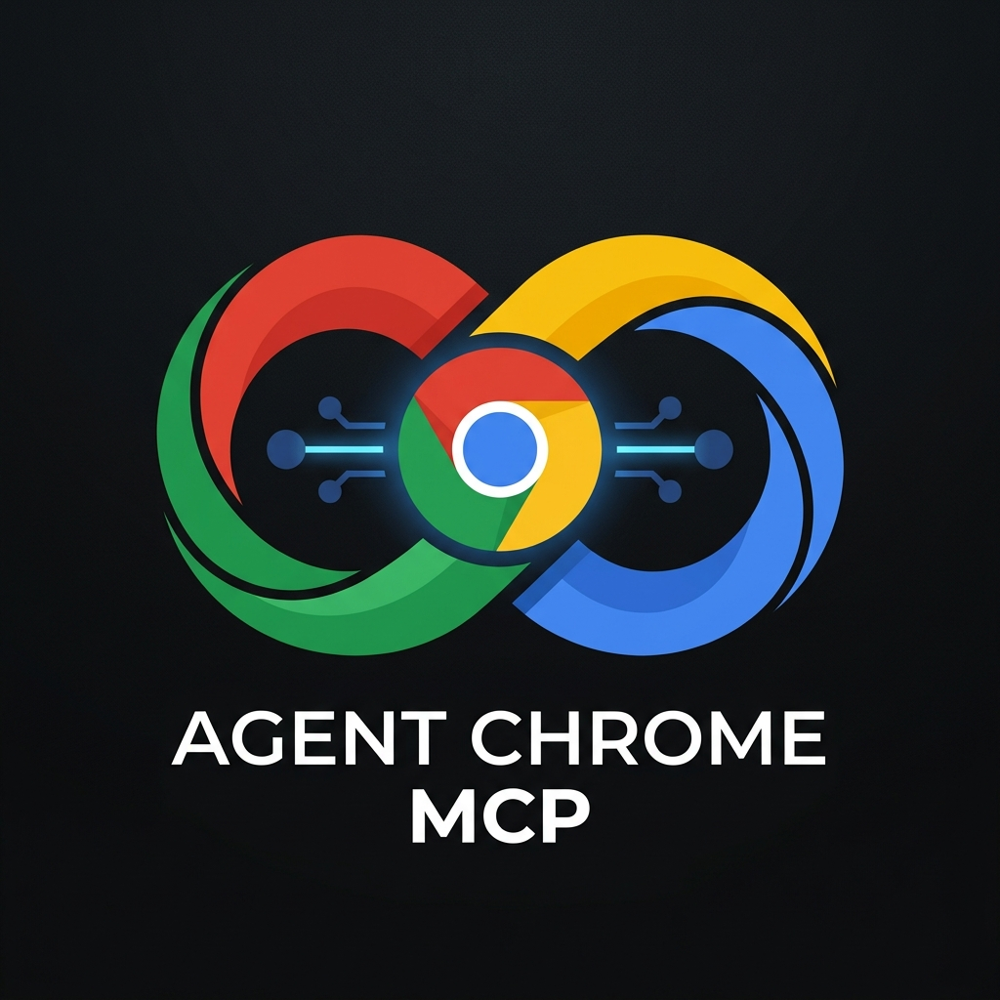
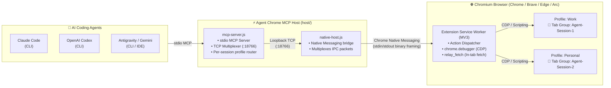

<p align="center">
  
</p>

<h1 align="center">Agent Chrome MCP</h1>

<p align="center">
  <em>Control your real, signed-in Chromium browser profiles directly from <b>Claude Code</b>, <b>Codex</b>, and <b>Antigravity</b>.</em>
</p>

---

## ⚡ What It Provides

- **Use Your Existing Sessions**: Automate workflows on sites you are already logged into (Upwork, GitHub, Google, Canva, Udemy, internal dashboards, etc.) without exposing credentials or managing browser sessions manually.
- **Multi-Profile & Multi-Client Multiplexing**: Run multiple AI sessions concurrently (Claude Code + Codex + Antigravity) across different browser profiles (`work`, `personal`, `phidndev`) with automatic routing.
- **Isolated Tab Groups**: Named tab groups keep each agent's active tabs cleanly separated.
- **Rich Action Suite**: Click, type, scroll, drag, screenshots, console/network inspection, file upload, screen recording, and in-page authenticated relay fetching (`relay_fetch`).

---

## 🏗️ Architecture



### How it works:
1. **AI Agents** connect to `host/mcp-server.js` via standard stdio MCP transport.
2. **Multiplexer & Host**: The primary MCP server manages a lightweight local TCP bridge (`127.0.0.1:18766`), letting multiple concurrent agent sessions share the same browser connection seamlessly.
3. **Browser Extension**: Native Messaging bridges commands directly into the browser's MV3 service worker, executing actions via Chrome DevTools Protocol (CDP) and standard Extension APIs.

---

## 🚀 One-Prompt Install

Copy and paste this prompt directly into your AI coding assistant (**Claude Code**, **Codex**, or **Antigravity**):

```text
Please set up agent-chrome-mcp for me:
1. Clone https://github.com/phidn/agent-chrome-mcp.git into ~/.config/agent-chrome-mcp-repo (or keep if already in this repo).
2. Tell me to open chrome://extensions in Developer mode, click "Load unpacked", and select the extension/ directory.
3. Ask me for the 32-character Extension ID.
4. Once I provide the Extension ID, run ./scripts/install.sh <EXTENSION_ID> to register the native messaging host.
5. Add the stdio MCP server to my client configuration and verify with the healthcheck tool.
```

*(Your AI agent will guide you through loading the unpacked extension, execute the install script, and configure its own MCP server settings).*

---

<details>
<summary><b>💻 Manual Terminal Setup (Click to expand)</b></summary>

### 1. Load Extension
1. Clone the repo:
   ```bash
   git clone https://github.com/phidn/agent-chrome-mcp.git
   cd agent-chrome-mcp
   ```
2. Open `chrome://extensions` (or `brave://extensions`, `edge://extensions`).
3. Enable **Developer mode** (top right toggle).
4. Click **Load unpacked** and select the `extension/` folder.
5. Copy the 32-character **Extension ID**.

### 2. Run Installer
```bash
./scripts/install.sh <extension-id>
# Or run interactively:
make install
```
> **Note**: Fully quit (Cmd+Q on macOS) and reopen your browser so Chrome picks up the registered native messaging host.

### 3. Add to AI Client

```bash
# Claude Code
claude mcp add -s user agent-chrome-mcp -- "$(command -v node)" "$(pwd)/host/mcp-server.js"

# OpenAI Codex
codex mcp add agent-chrome-mcp -- "$(command -v node)" "$(pwd)/host/mcp-server.js"
```

For **Antigravity (CLI / IDE)**, add the server to `~/.gemini/antigravity-cli/mcp_config.json` (or `.agents/mcp.json`):

```json
{
  "mcpServers": {
    "agent-chrome-mcp": {
      "command": "node",
      "args": ["/path/to/agent-chrome-mcp/host/mcp-server.js"]
    }
  }
}
```

</details>

---

## 🏷️ Profile Routing

If you work with multiple browser profiles (e.g. Work, Personal):
1. Load the extension in each profile.
2. Open the extension **Options** (`chrome://extensions` → Details → Extension options) and set a friendly profile label (e.g. `work` or `personal`).
3. Direct your agent:
   ```text
   list_browsers()
   switch_browser({ profile: "work" })
   ```
   Or pass `profile: "work"` directly inside any tool call.

---

## 🛠️ Helper Commands

A `Makefile` is included for common management tasks:

| Command | Description |
| :--- | :--- |
| `make install` | Interactive installer to register native messaging host |
| `make install IDS="<id1> <id2>"` | Register specific extension IDs directly |
| `make uninstall` | Remove native messaging manifests and wrapper script |
| `make chrome` | Launch Chrome with `--silent-debugger-extension-api` (hides debugger banner) |
| `make chrome-app` | *(macOS)* Creates `/Applications/Chrome MCP.app` for Spotlight launch |
| `make chrome-remove` | Removes `/Applications/Chrome MCP.app` |

---

## 🔒 Security

- The extension only controls tabs assigned to Agent Chrome MCP tab groups.
- All IPC traffic stays entirely local to `127.0.0.1`.
- No credentials or authentication cookies leave your local machine.
