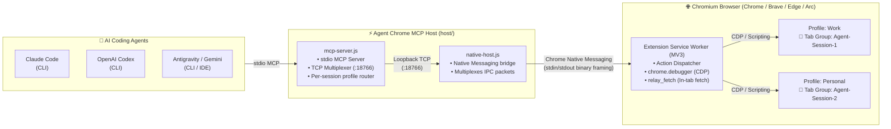

<p align="center">
  
</p>

<h1 align="center">Agent Chrome MCP</h1>

<p align="center">
  <em>Control your real, signed-in Chromium browser profiles directly from <b>Claude Code</b>, <b>Codex</b>, and <b>Antigravity</b>.</em>
</p>

---

## ⚡ What It Provides

- **Use Your Existing Sessions**: Automate workflows on sites you are already logged into (Upwork, GitHub, Google, Canva, Udemy, internal dashboards, etc.) without exposing credentials or managing browser sessions manually.
- **Multi-Profile & Multi-Client Multiplexing**: Run multiple AI sessions concurrently (Claude Code + Codex + Antigravity) across different browser profiles (`work`, `personal`, `phidndev`) with automatic routing.
- **Isolated Tab Groups**: Named tab groups keep each agent's active tabs cleanly separated.
- **Rich Action Suite**: Click, type, scroll, drag, screenshots, console/network inspection, file upload, screen recording, and in-page authenticated relay fetching (`relay_fetch`).

---

## 🏗️ Architecture



### How it works:
1. **AI Agents** connect to `host/mcp-server.js` via standard stdio MCP transport.
2. **Multiplexer & Host**: The primary MCP server manages a lightweight local TCP bridge (`127.0.0.1:18766`), letting multiple concurrent agent sessions share the same browser connection seamlessly.
3. **Browser Extension**: Native Messaging bridges commands directly into the browser's MV3 service worker, executing actions via Chrome DevTools Protocol (CDP) and standard Extension APIs.

---

## 🚀 Quick Install (1-Minute Setup)

### Step 1: Load Extension
1. Clone this repo:
   ```bash
   git clone https://github.com/phidn/agent-chrome-mcp.git
   cd agent-chrome-mcp
   ```
2. Open `chrome://extensions` (or `brave://extensions`, `edge://extensions`).
3. Turn on **Developer mode** (top right toggle).
4. Click **Load unpacked** and select the `extension/` folder.
5. Copy the 32-character **Extension ID** displayed on the extension card.

### Step 2: Run Installer
Run the installer with your Extension ID (it automatically builds dependencies and registers native host manifests for Chrome, Brave, and Edge):

```bash
./scripts/install.sh <extension-id>
```
*(Or just run `./scripts/install.sh` / `make install` to enter the ID interactively).*

> **Note**: Fully quit (Cmd+Q on macOS) and reopen your browser so Chrome picks up the newly registered native messaging host.

### Step 3: Add to Your AI Client

```bash
# Claude Code
claude mcp add -s user agent-chrome-mcp -- "$(command -v node)" "$(pwd)/host/mcp-server.js"

# OpenAI Codex
codex mcp add agent-chrome-mcp -- "$(command -v node)" "$(pwd)/host/mcp-server.js"
```

For **Antigravity (CLI / IDE)**, add the server to `~/.gemini/antigravity-cli/mcp_config.json` (or `.agents/mcp.json` in your workspace):

```json
{
  "mcpServers": {
    "agent-chrome-mcp": {
      "command": "node",
      "args": ["/path/to/agent-chrome-mcp/host/mcp-server.js"]
    }
  }
}
```

---

## 💬 One-Prompt Agent Setup

If you are already inside Claude Code, Codex, or Antigravity, you can simply paste this prompt:

```text
Please set up agent-chrome-mcp for me using extension ID: <YOUR_EXTENSION_ID>
Run ./scripts/install.sh <YOUR_EXTENSION_ID> and configure your MCP settings.
```

---

## 🏷️ Profile Routing

If you work with multiple browser profiles (e.g. Work, Personal):
1. Load the extension in each profile.
2. Open the extension **Options** (`chrome://extensions` → Details → Extension options) and set a friendly profile label (e.g. `work` or `personal`).
3. Direct your agent:
   ```text
   list_browsers()
   switch_browser({ profile: "work" })
   ```
   Or pass `profile: "work"` directly inside any tool call.

---

## 🛠️ Helper Commands

A `Makefile` is included for common management tasks:

| Command | Description |
| :--- | :--- |
| `make install` | Interactive installer to register native messaging host |
| `make install IDS="<id1> <id2>"` | Register specific extension IDs directly |
| `make uninstall` | Remove native messaging manifests and wrapper script |
| `make chrome` | Launch Chrome with `--silent-debugger-extension-api` (hides debugger banner) |
| `make chrome-app` | *(macOS)* Creates `/Applications/Chrome MCP.app` for Spotlight launch |
| `make chrome-remove` | Removes `/Applications/Chrome MCP.app` |

---

## 🔒 Security

- The extension only controls tabs assigned to Agent Chrome MCP tab groups.
- All IPC traffic stays entirely local to `127.0.0.1`.
- No credentials or authentication cookies leave your local machine.
